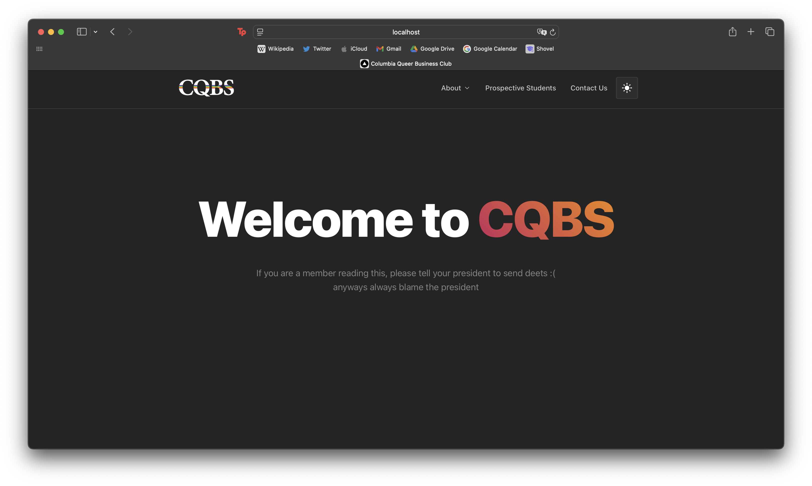

# Columbia Queer Business Society Website
## Website still in development!!!
NextJS based website built for Columbia Queer Business Society in Columbia 
University. The website makes use of NextJS and Mantine to get most of the 
aesthetics. Form handling is done by Pageclip.

Made with ❤️ by Jiyoo Dojun @ucsandiego
